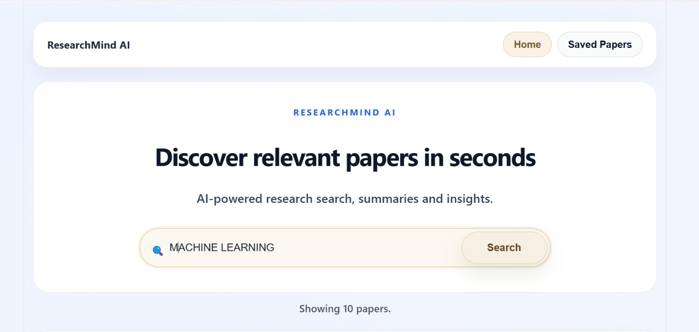
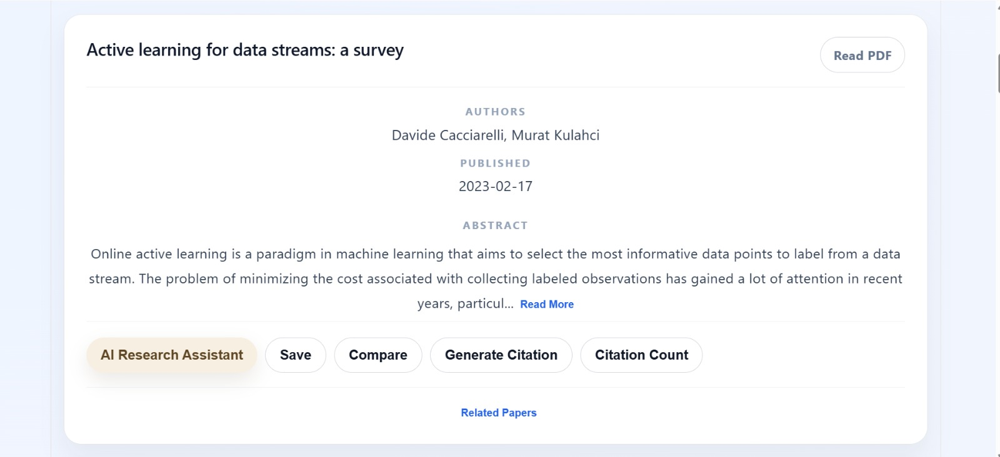
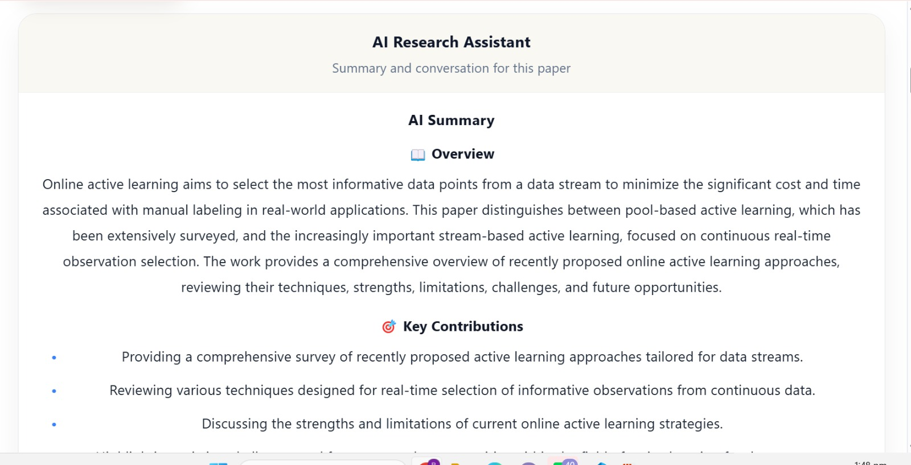
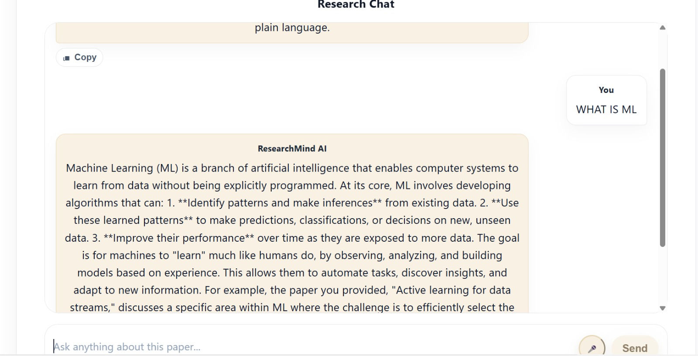
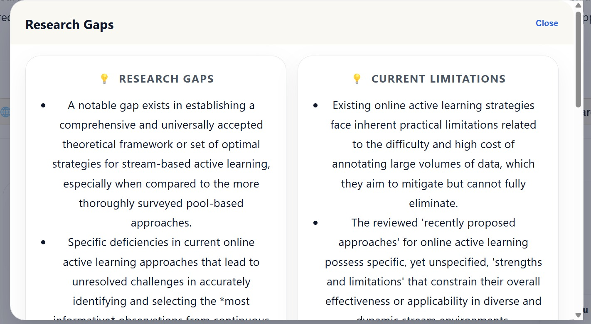
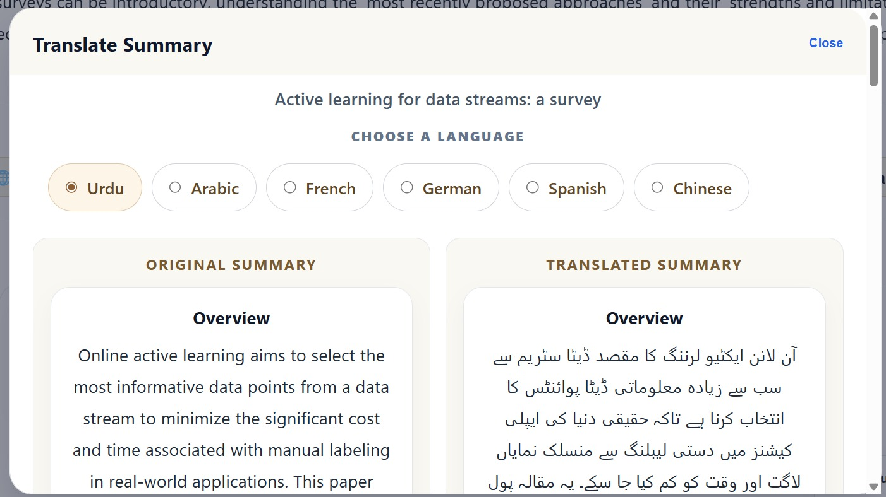
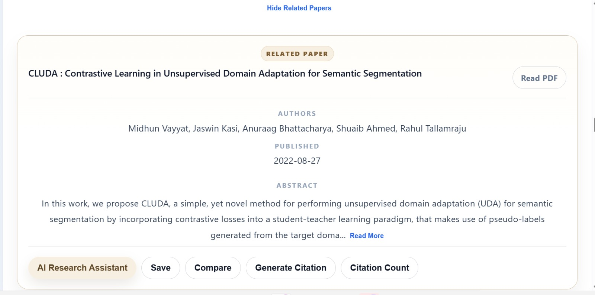
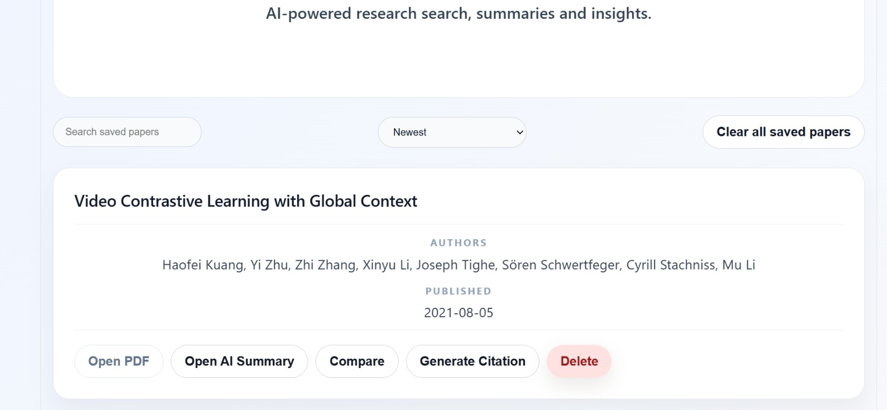
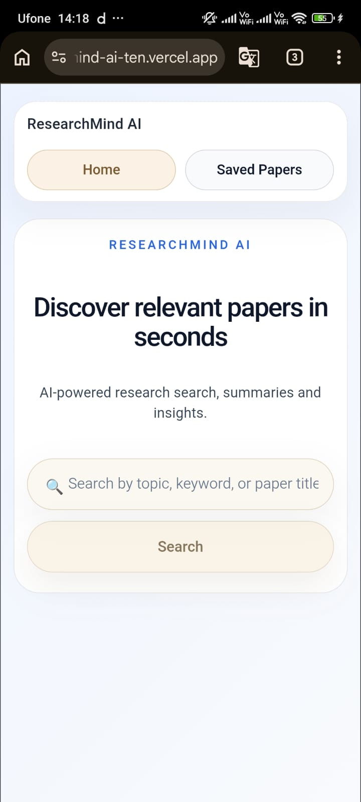

# 🧠 ResearchMind AI

<p align="center">
  <strong>AI-Powered Research Assistant for Discovering, Summarizing, Comparing, and Analyzing Academic Papers</strong>
</p>

<p align="center">
ResearchMind AI helps students, researchers, and professionals discover research papers, generate AI-powered summaries, compare publications, analyze research gaps, and streamline academic research.
</p>

---

# 📖 Overview

ResearchMind AI is a full-stack web application designed to simplify academic research by combining paper discovery with AI-powered analysis.

Instead of spending hours reading multiple research papers, users can search for academic publications, generate concise AI summaries, compare papers side by side, identify research gaps, translate content, generate citations, and access PDFs—all from a single platform.

The project aims to make research faster, smarter, and more accessible.

---

# ✨ Features

- 🔍 Search academic papers
- 🤖 AI-powered paper summaries
- 💬 AI Research Chat
- 📊 Compare multiple research papers
- 📚 Automatic citation generation
- 📈 Citation count tracking
- 🧩 Research gap analysis
- 🌍 Translate AI summaries
- 🔗 Related paper recommendations
- 💾 Save favorite papers
- 📄 Built-in PDF viewer
- 📤 Share research papers
- 🎤 Voice search
- 📱 Fully responsive interface

---

# 🛠️ Tech Stack

## Frontend

- React
- Vite
- JavaScript
- CSS

## Backend

- FastAPI
- Python

## Artificial Intelligence

- Google Gemini API

## Research APIs

- arXiv API

## Deployment

- Vercel (Frontend)
- Render (Backend)

---

# 📂 Project Structure

```text
ResearchMind-AI/
│
├── backend/
│   ├── main.py
│   ├── paper_search.py
│   ├── summary.py
│   ├── citation_count.py
│   ├── test.py
│   ├── requirements.txt
│   └── ...
│
├── frontend/
│   ├── public/
│   ├── src/
│   ├── package.json
│   ├── vite.config.js
│   └── ...
│
├── README.md
└── .gitignore
```

---

# 🚀 Live Demo

### 🌐 Frontend

https://research-mind-ai-ten.vercel.app

### ⚙️ Backend API

https://researchmind-ai-89gs.onrender.com

---

# 🚀 Getting Started

## Clone the Repository

```bash
git clone https://github.com/Rohanmunir16/ResearchMind-AI.git
```

---

## Backend Setup

```bash
cd backend

pip install -r requirements.txt

uvicorn main:app --reload
```

Backend runs at

```
http://127.0.0.1:8000
```

---

## Frontend Setup

```bash
cd frontend

npm install

npm run dev
```

Frontend runs at

```
http://localhost:5173
```

---

# ⚙️ Environment Variables

Create a `.env` file inside the **backend** folder.

```env
GEMINI_API_KEY=YOUR_GEMINI_API_KEY
```


---

# 📸 Screenshots

## 🏠 Homepage



---

## 🔍 Search Results



---

## 🤖 AI Summary



---

## 💬 AI Research Chat



---

## 💡 Research Gap Analysis



---

## 🌍 Translation



---

## 📚 Related Papers



---

## ❤️ Saved Papers


---

## 📱 Mobile Responsive Interface



---

# 🎯 Key Highlights

- Modern React frontend
- FastAPI backend
- Google Gemini AI integration
- Academic paper discovery
- AI-assisted research workflow
- Responsive desktop and mobile design
- Fully deployed using Vercel and Render

---

# 🔮 Future Improvements

- User authentication
- Personal research collections
- Cloud synchronization
- Advanced paper filtering
- Dark mode
- PDF export
- AI research assistant with conversational memory

---

# 👨‍💻 Author

**Rohan Munir**

BS Computer Science Student

GitHub:
https://github.com/Rohanmunir16

LinkedIn:
https://www.linkedin.com/in/rohan-munir-ab92a3331/

---

# ⭐ Support

If you found this project helpful, consider giving it a **⭐ Star** on GitHub.

It helps support the project and encourages future development.